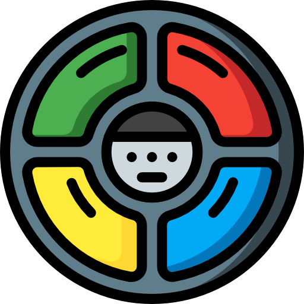
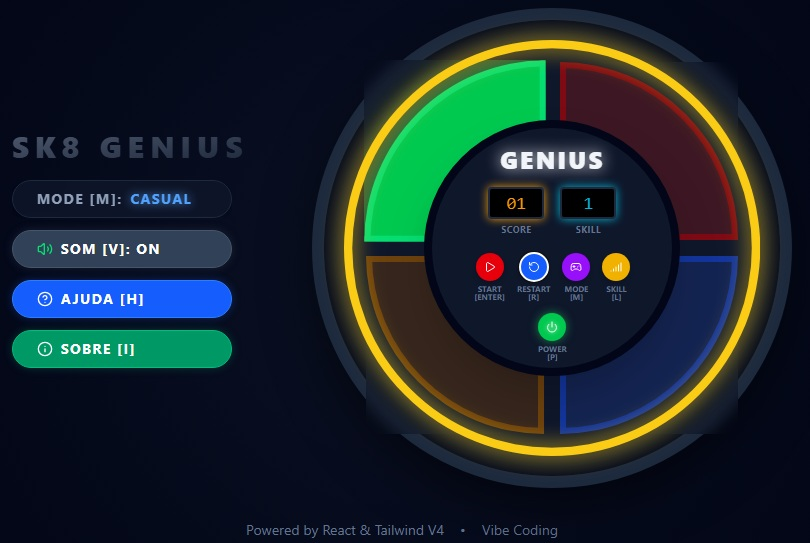
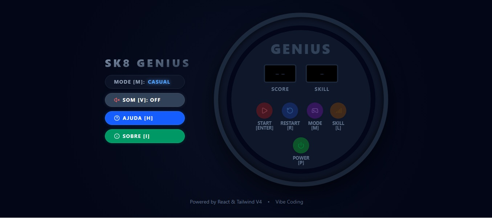
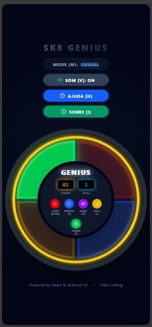
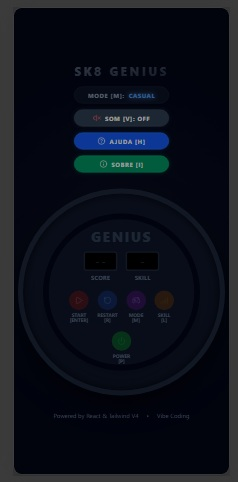
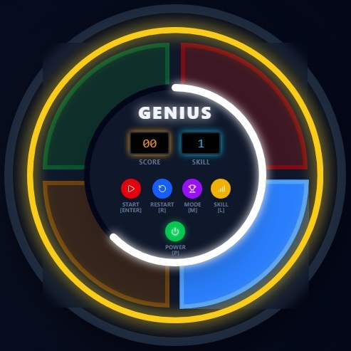
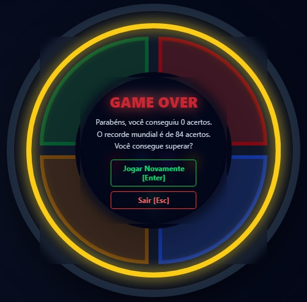
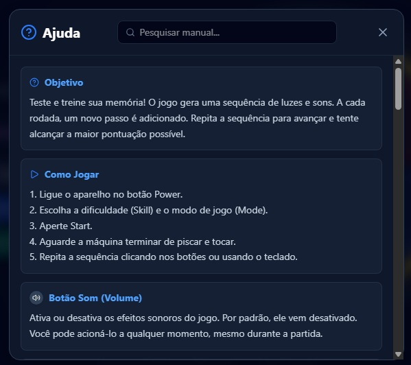
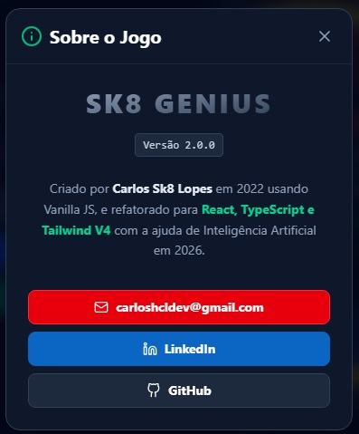

  
  
  # Sk8-Genius | O Clássico Jogo de Memória 🎮
  
  **Uma experiência imersiva e eletrizante, traduzida em código de altíssima performance e engenharia sonora avançada.**

  **Stack Tecnológico**
   
  
  
  
  

  **Metodologia & Habilidades**
   
  
  
  
  

 

---

## 🌐 Deploy & Link do Projeto

A aplicação está publicada e disponível para acesso através do link oficial abaixo:

**👉 Jogue agora: [Sk8-Genius](https://sk8-genius.netlify.app/)**

> [!TIP] 
> Para uma experiência completa, **certifique-se de que o áudio do seu dispositivo está ativado** para interagir com o sintetizador de frequências.

---

## 📖 Visão Geral

Este projeto é uma **evolução massiva** de um clone do clássico "Simon Says" (Genius) concebido em 2022 usando Vanilla JS puro. O objetivo da refatoração atual foi levar o projeto de um simples "exercício lógico" a uma aplicação *Front-End* com **grau de produção impecável**, focando em mecânicas modernas de UI/UX, acessibilidade completa para Power Users e performance extrema.

A aplicação foi reescrita utilizando **React** tipado com **TypeScript** e estilizado com a potência e flexibilidade do **Tailwind CSS v4**, orquestrado pelo **Vite** para entregar um *bundle* ultraleve.

---

## 📸 Interface e Layout

### O Clássico em Alta Resolução (Desktop & Tablet)
| Jogo em Execução (Ligado) | Máquina em Espera (Desligada) |
| :---: | :---: |
|  |  |

### Responsividade e Experiência Mobile
| Visão Mobile (Ligado) | Visão Mobile (Desligado) |
| :---: | :---: |
|  |  |

### Modos Avançados e UI de Fim de Jogo
| Modo Competitivo (Aro de LED) | Tela de Game Over |
| :---: | :---: |
|  |  |

### Documentação Integrada e Modais
| Manual de Ajuda (Interativo) | Painel Sobre |
| :---: | :---: |
|  |  |

---

## 🚀 Atualizações e Melhorias Arquiteturais

O projeto saltou de nível em múltiplos pilares de Engenharia de Software e Design de Produto. Abaixo, o comparativo estrutural da refatoração:

| Pilar Técnico | Como Era (Vanilla JS - 2022) | Como Está Agora (React/TS - Atual) |
| :--- | :--- | :--- |
| 🏗️ **Arquitetura & Stack** | HTML/CSS isolados com forte acoplamento e manipulação direta do DOM. | Ecossistema React tipado. Lógica isolada no Custom Hook `useGeniusGame`, garantindo separação de responsabilidades. |
| 🎨 **Design (UI/UX)** | Estilização básica, estática e com responsividade rígida. | Tailwind CSS v4 com Design System moderno (*Glassmorphism*, *Drop-Shadows* de neon responsivos a 60 FPS). |
| 🎮 **Mecânicas de Jogo** | Fluxo estático de velocidade única e mecânica base. | 4 Níveis de *Skill* (de 0.8s a 0.4s), visores digitais de *Score* e Modo Competitivo (Aro como barra de progresso até 124 acertos). |
| 🔊 **Engenharia Sonora** | Arquivos `.mp3` convencionais, sujeitos a latência e delay de rede. | Sintetizador via **Web Audio API**. Frequências geradas em tempo real (latência zero) com política de áudio *Opt-in* (inicia mutado). |
| ⌨️ **Acessibilidade (A11y)** | Interação focada puramente em cliques do mouse. | Suporte total a teclado (*Power Users*). Teclas grafadas na UI, navegação completa por atalhos e Modal de Ajuda com motor de busca. |
| ⚡ **Performance & Seg.** | Sujeito a repinturas excessivas no DOM e ausência de headers de segurança. | *Memoization* (`React.memo`) garantindo bundle de **~79 KB**. Injeção de políticas **CSP** rígidas contra injeção de scripts/XSS. |
| ⚙️ **Infraestrutura (CI/CD)** | Deploy manual, sem validação automatizada ou testes de esteira. | Esteira CI via GitHub Actions (testes no Vitest, auditoria estrita) acoplada ao CD via Netlify. |

## 🏛️ Histórico e Versão Legada

Para fins de estudo arquitetural e comparação de performance, o código-fonte e o deploy da versão original de 2022 (desenvolvida inteiramente em Vanilla JS) permanecem abertos.

- **Repositório Legado:** [https://github.com/CHCLopes/Sk8-Genius-Game](https://github.com/CHCLopes/Sk8-Genius-Game) 
- **Jogar Versão Legada:** [https://sk8genius.netlify.app/](https://sk8genius.netlify.app/)

A comparação prática entre as duas versões evidencia a eliminação de repinturas desnecessárias do DOM e a mitigação da latência de áudio alcançadas nesta versão em React.

---

## 🛠️ Guia de Manutenção (Para futuros Devs)

A longevidade do código baseia-se na clareza modular. Para escalar ou modificar funcionalidades, siga as premissas abaixo:

1. **Alterando a Lógica de Jogo:**
   * Regras matemáticas puras, matriz de validação e geração de cores ficam em `src/utils/gameLogic.ts`.
   * Para alterar temporizações da velocidade, comportamento das fases, e pontuações do "Modo Competitivo", modifique exclusivamente o estado consolidado dentro do Hook central `src/hooks/useGeniusGame.ts`.
2. **Motor de Áudio:**
   * Todo o gerador de frequências mora no Singleton instanciado em `src/utils/audio.ts`. Se desejar alterar as notas musicais das lentes verde/vermelha/amarela/azul, modifique os hertz nativos deste arquivo.
3. **Gerenciamento de Renderização:**
   * Os painéis físicos do brinquedo não possuem regras de negócio e estão embrulhados em `React.memo` (`ColorPad` e `ControlPanel`). Se precisar injetar uma nova propriedade lá dentro, certifique-se de que a função foi gerada no Pai usando `useCallback` para evitar matar a otimização de repintura do Virtual DOM.

## ⚙️ Infraestrutura e CI/CD

O projeto conta com uma esteira de Integração e Entrega Contínua para garantir a estabilidade absoluta do código em produção e bloquear regressões.

- **CI (Integração Contínua):** Orquestrado via **GitHub Actions**. A cada novo *push* ou *pull request* na *branch* principal, um container Linux é provisionado automaticamente para:
  1. Realizar a instalação limpa e determinística de dependências (`npm ci`).
  2. Executar auditoria de segurança bloqueante (`npm audit --audit-level=high`).
  3. Executar a suíte de testes unitários da lógica matemática do jogo utilizando **Vitest**.
  4. Homologar a compilação do *build* final do Vite.
- **CD (Entrega Contínua):** Integrado ao **Netlify**. A publicação do link de produção é condicionada à aprovação integral da esteira de CI no GitHub. Se um teste de lógica falhar, o deploy é abortado.

---

## 📬 Contato

Se você quiser discutir sobre a arquitetura deste projeto, engenharia de prompt ou desenvolvimento web, conecte-se comigo:

---

  Desenvolvido por Carlos Sk8 Lopes. Elevando o padrão visual e mecânico de um clássico absoluto da nossa infância! 🛹🧠

